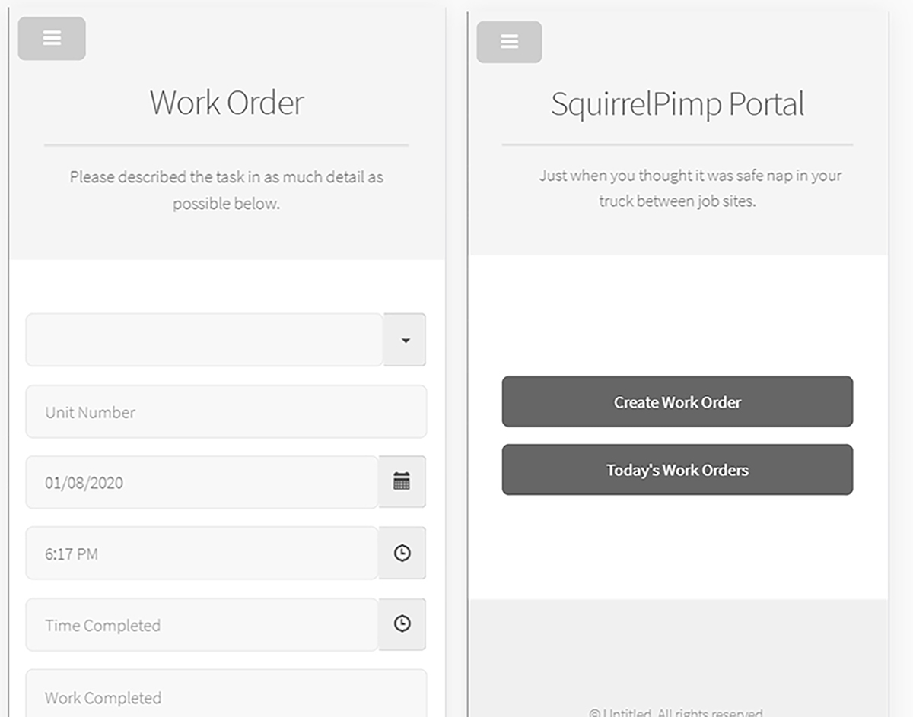

## BACKGROUND / PROBLEM
This site represents the first run to be present to a client using the clients specifications for workflow, functionality and design

## OBJECTIVE
Work with existing code to add necessary features and fix broken ones

## ROLE
UI development

## ACHIEVEMENTS
<ul class="li-style">
<li>Fixed build process using gulp.js</li>
<li>Add export to CSV file feature when users are accessing work order data</li>
<li>Simultaneously work on a more robust Angular 8 version of the same application</li>
<li>Fix bugs as QA and the client discover them</li>
</ul>

## OUTCOME
We were able to get all Jira tickets complete such that it could be presented to the client