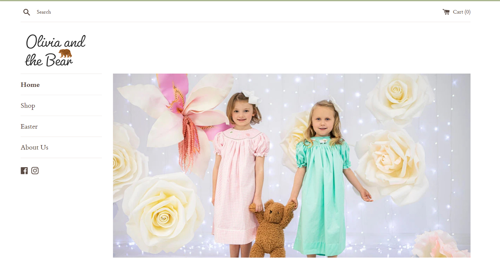

## BACKGROUND / PROBLEM
Work with the owners to build a store and fashion their brand of children's clothing. Educated the owner about the Shopify platform

## OBJECTIVE
They already have a presence on Facebook. Strengthen their brand buy having a unique domain with a custom store on Shopify

## ROLE
UI design

## STEPS
<ul class="li-style">
<li>Selected basic theme to start</li>
<li>Edit and modify the theme as needed</li>
<li>Create logo and optimize images for the web</li>
<li>Create pages, research good-performing apps before installing them, modify liquid template</li>
</ul>

## OUTCOME
The store is set to launch this month (February) with good expectations for success
