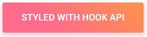

:100: "If we take anything from Material Design it's not how to use color, how your ease timing should be set, or what the resting elevation of an object should be. It’s not the details themselves we take away, it’s how the details combine to create purposeful brand experience...the interface is the brand" ~ [wired](https://www.wired.com/insights/2014/12/google-material-design/)


### React follows Lollipop with it's own Material Design libraries.

A set of react components that implements Googles Material Design specification. [React Material Design](https://www.npmjs.com/package/@material-ui/core)

```javascript
import { makeStyles } from '@material-ui/core/styles';
import Button from '@material-ui/core/Button';
import Color from "color";
import colors from "./colors";

const useStyles = makeStyles({
  root: {
    background: 'linear-gradient(45deg, #FE6B8B 30%, #FF8E53 90%)',
    border: 0,
    borderRadius: 3,
    boxShadow: '0 3px 5px 2px rgba(255, 105, 135, .3)',
    color: 'white',
    height: 48,
    padding: '0 30px',
  },
});

export default function Hook() {
  const classes = useStyles();
  return <Button className={classes.root}>Hook</Button>;
}
```
### Donec hendrerit laoreet risus eget adipiscing.



