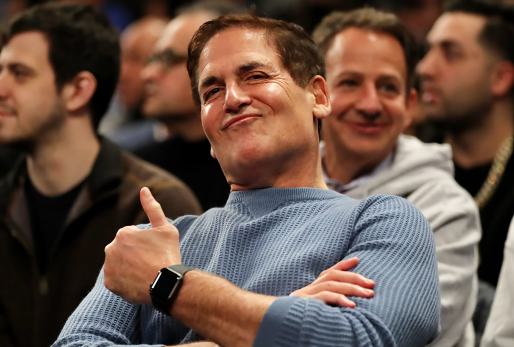

I recently read an article on NBC's "Make It", not my favorite news source and this article is a reason why, where they interviewed celebrity billionaire Mark Cuban, asking him what he thought the best businesses to start would be in 2020. He suggested starting a service-oriented business setting up the Alexa and Google at home for people - "Alexa skills and scripting Alexa skills is really, really easy. But everybody thinks it’s really, really hard". On the surface, this seems to be a great idea if, in fact, you can get customers. While going from zero to customers is not impossible, it's hard with no contacts in the industry. 

Even though getting customers was not the subject of the article, I took it upon myself to kick around a few ideas anyway. 1) Going door-to-door, or even mall-to-mall, with leaflets and leaving them in mailboxes and on windshields is a cheap and easy way to get the word out. (Malls are best because there's some chance people had purchased an Alexa while shopping). While it's cheap, and easy, probably not very effective because it's not targeted. 2) Asking retailers to recommend my business to customers buying the devices. Again, I'm not at all convinced this will work for a variety of reasons. It takes a bit of luck and some creativity to promote a new business on a budget. Rather than make ICE tea or mow lawns, Cuban suggests kids learn to script and go to the neighbors and offer to set up their devices. Not a bad idea, for kids.

Starting a business is extremely risky because you may not have the perseverance to go the distance. Given that Cuban probably knowns this, his career advice to budding entrepreneurs was stupendously irresposible. He went on to suggested people quit their 9-to-5 jobs to, instead, become bartenders so they can, I guess, have more time during the day to research and do other business functions. What?!

Let's examine the bartending idea for a minute since it's one of my favorite suggestions ever. (sarcasm). So not only would most people take a nice hit in salary by quitting their jobs for a tips-based career, but suddenly find themselves having to learn a whole new set of skill just to make menial wages. And wouldn't you need the extra money to start and grow the business? Cuban never really addressed that. At any rate, you don’t just become a bartender over night after never having worked as one before anyway. It doesn't work that way. It's not surprising Cuban suggested this path, however, since it's how he started in college. Moreover, Cuban has publically stated he'd rather make 50k working for himself than make a 100k working for someone else. I guess he occasionally spews his hatred of corporate America because he's having a bad day or is feeling particularly superior at the time. Whatever the reason, do not quite your job to become a bartender. 

Perhaps the best way to break into a new industry and learn is to get a job with Amazon or Google. You might even be able to get customers from that job somehow. Talk to your co-workers or the sales department and tell them what you have in mind. This goes for nearly every business in the high-tech world - get a job in that industry, first to learn about it then go out to conquer it. Cuban is out to lunch with his advice on this. Given Cuban's hatred of being a subordinate, I say take a lot of what he says about your career with a grain of salt. And take everything NBC's "Make it" has to say with a grain of salt.

__As of this publication, the CNBC article must have edited out where Mark Cuban suggests people quit their jobs to become bartenders. I promise it was in there at one time though. I guess I'm not the only one that thought it was bad advice.
If anyone reading this has the article with it in there, please add it in the comments.__ [Article](https://www.cnbc.com/2019/03/18/billionaire-shark-tank-judge-mark-cuban-if-i-were-to-start-a-business-today-heres-what-it-would-be.html)

