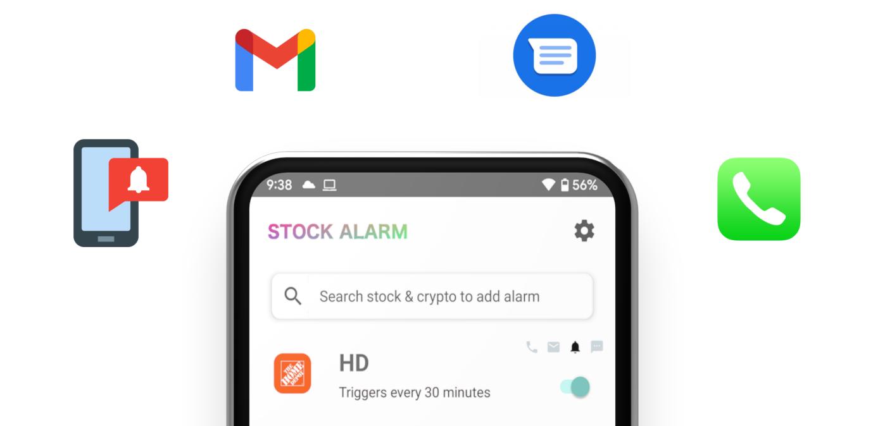

### Metro Meet for spontaneous dating
 
### Android & iPhone app
* Currently available on Google Play and the App Store
* 796kb smaller download size with Harmes engine enabled
* Easy to navigate and use 

### Features
* Percent, Price, and Trailing alarms
* Real-time data using IEX api
* Monitor stocks by volume, long and short-term trends
* Recieve scans of over 500 stocks when the market opens 
* Compatible with Android devices 4.1 and up & iPhone 9+

### Availability

 

 

